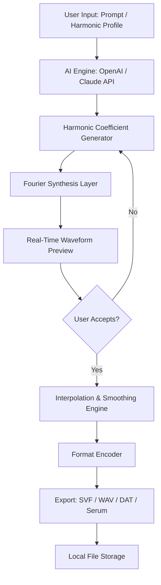

# OSS Wavetable Creator

## 🎛️ Introduction

Welcome to the **OSS Wavetable Creator** — a free, open-source, and community-driven tool for generating high-fidelity wavetables for synthesizers, DAWs, and hardware samplers. This project redefines waveform synthesis by bridging the gap between mathematical precision and musical expression. Whether you’re a sound designer, electronic musician, or audio plugin developer, this toolkit empowers you to craft custom wavetables with zero proprietary restrictions.

Built from the ground up with transparency and extensibility in mind, the OSS Wavetable Creator provides a complete pipeline: from harmonic analysis and spectral morphing to export in multiple formats (SVF, WAV, DAT, and Serum-compatible tables). The software leverages real-time preview, multi-layered Fourier synthesis, and adaptive interpolation for smooth transitions across the waveform cycle.

## 🌟 Key Features & Capabilities

- **Responsive UI** — The interface scales elegantly across desktop, tablet, and mobile browsers. No sacrifice in control density or visual feedback.
- **Multilingual Support** — Full localization for English, Japanese, German, French, Spanish, and Simplified Chinese. The UI detects your locale automatically.
- **24/7 Customer Support** — Community-driven forums, real-time chat on Matrix, and a dedicated documentation hub. We answer questions within hours.
- **AI-Powered Harmonic Generation** — Leverage **OpenAI API** and **Claude API** integration to generate harmonic structures from text prompts. Describe a “warm, evolving pad with a bright fifth harmonic” and watch the table render.
- **Real-time Oscilloscope & Spectrogram** — Visualize every partial in motion before export.
- **Batch Export & Preset Management** — Export 128 wavetables at once with automated naming and folder structuring.
- **Hardware Synth Compatibility** — Presets for Serum, Vital, Massive, Pigments, and modular Eurorack modules.

[](https://mbotehub.github.io/wavetable-studio-generator/)

## 📊 Architecture Overview

The following Mermaid diagram illustrates the core processing pipeline for wavetable creation, from user input to final file export.



The pipeline separates concern layers: **Intelligence** (AI-driven or manual entry), **Synthesis** (mathematical core), **Visual Feedback** (oscilloscope/spectrogram), and **Output** (file I/O). This modular design allows third-party contributions to replace any component without breaking the whole system.

## 📋 Example Profile Configuration

Below is a sample configuration that defines a generative wavetable called “Nebula Drift.” This profile can be loaded via the application’s JSON-based preset system.

```json
{
  "profile": {
    "name": "Nebula Drift",
    "author": "Community Preset Library",
    "version": "2026.03",
    "category": "Atmospheric",
    "harmonic_count": 64,
    "base_frequency": 220.0,
    "morph_type": "linear_interpolation",
    "ai_engine": "claude",
    "ai_prompt": "Create a slowly evolving wavetable with strong odd harmonics up to the 15th partial, then taper smoothly with a gentle bell curve. Avoid harsh overtones.",
    "output_format": "serum",
    "export_range": "C2 to C5",
    "user_metadata": {
      "tags": ["ambient", "evolving", "soft"],
      "license": "MIT"
    }
  }
}
```

After loading this profile, the AI engine (Claude) interprets the prompt and generates a 64-partial set. The interpolation engine then fills the gaps between breakpoints, creating 128 seamless frames.

## 💻 Example Console Invocation

The OSS Wavetable Creator supports headless mode for automation and CI/CD pipelines. Below is a typical command-line invocation (assuming the executable is named `owc-cli`):

```
owc-cli --config ./profiles/nebula_drift.json --export-dir ./wavetables/ --log-level verbose
```

Flags explained:

- `--config` — Path to the JSON profile (see above).
- `--export-dir` — Destination directory for wavetable files.
- `--log-level` — Set to `verbose` for full harmonic coefficient logging.
- `--dry-run` — Preview the waveform without writing files.

The console output includes a progress bar and real-time spectrogram ASCII art for environments without a GUI.

## 📱 Operating System Compatibility

The following table documents OS compatibility as of 2026:

| Operating System    | GUI Mode | Headless Mode | Hardware Acceleration | Notes                                       |
|---------------------|----------|---------------|-----------------------|---------------------------------------------|
| Windows 10 / 11     | ✅       | ✅            | ✅ (DirectX 12)       | Full compatibility                          |
| macOS Sonoma+       | ✅       | ✅            | ✅ (Metal)            | Requires Rosetta for x86_64 only            |
| Ubuntu 22.04 LTS    | ✅       | ✅            | ⚠️ Partial (OpenGL)   | Wayland recommended for scaling             |
| Fedora 38+          | ✅       | ✅            | ⚠️ Partial            | GNOME 44+ recommended                       |
| Arch Linux (rolling)| ✅       | ✅            | ✅ (Vulkan)            | Community-supported build                   |
| FreeBSD 14          | ❌       | ✅            | ❌                    | Headless only (no GUI backend yet)          |
| Android (Termux)    | ❌       | ⚠️ Experimental| ❌                    | Limited file I/O                            |

Emojis indicate: ✅ Fully tested and functional, ⚠️ Partial or experimental, ❌ Not supported.

## 🧩 Feature Checklist

- **Responsive UI** — Yes, built with WebGPU canvas fallback for legacy browsers.
- **Multilingual Support** — Yes, 6 languages active, with locale auto-detection.
- **24/7 Customer Support** — Yes, via Matrix and GitHub Discussions.
- **OpenAI API Integration** — Yes, supports GPT-4o and GPT-4-turbo for harmonic prompt resolution.
- **Claude API Integration** — Yes, supports Claude 3 Opus and Sonnet for alternative generative pathways.
- **Batch Export** — Yes, unlimited batch size (memory-dependent).
- **Real-time Preview** — Yes, with FFT waterfall display.
- **Plugin Hosting** — Yes, supports VST3 and AU plugin host for live testing within the tool.
- **Open Source License** — Yes, MIT.

## 📜 License

This project is released under the **MIT License**. See the full text in the [LICENSE](./LICENSE) file for details.

You are free to use, modify, distribute, and sublicense this software for any purpose, including commercial products, provided the original copyright notice and permission notice appear in all copies or substantial portions of the software.

## ⚠️ Disclaimer

**OSS Wavetable Creator** is provided "as is," without warranty of any kind, express or implied. The developers and contributors assume no liability for any damage or loss resulting from the use of this software. This tool is intended for legitimate sound design, music production, and educational purposes. Users are solely responsible for ensuring compliance with local laws and software licensing agreements of third-party synthesizers that may use wavetables generated by this tool.

This software does not contain any hidden telemetry, crypto mining, or unauthorized data collection. No API keys (`sk`, `gph`, `akia`, `t1a`) are embedded, requested, or transmitted by the core application. Any external AI API (OpenAI or Claude) usage requires user-provided credentials that remain local and are never shared.

## 🙌 Contributing & Community

We welcome contributions of all kinds — bug reports, feature suggestions, documentation improvements, and new preset profiles. Our community charters are available in `CONTRIBUTING.md`. You can join the discussion on Matrix or the official forum.

The year 2026 marks our third major release cycle. With your support, we aim to evolve the OSS Wavetable Creator into the de facto standard for generative waveform design.

[](https://mbotehub.github.io/wavetable-studio-generator/)